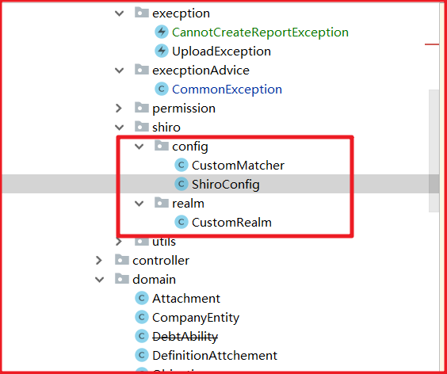

# ShiroStudy
学习有关shiro相关知识

## 快速启动

建议使用一般要配置三个地方



CustomMatcher用来自定义密码比对逻辑,从数据库获取到的加密数据与用户登录时输入的未加密数据进行比对,加密逻辑写在这里。

```java
package com.westcredit.qujiang.common.shiro.config;

import com.westcredit.qujiang.common.utils.PasswordHelper;
import com.westcredit.qujiang.common.utils.SystemService;
import org.apache.shiro.authc.AuthenticationInfo;
import org.apache.shiro.authc.AuthenticationToken;
import org.apache.shiro.authc.UsernamePasswordToken;
import org.apache.shiro.authc.credential.SimpleCredentialsMatcher;

public class CustomMatcher extends SimpleCredentialsMatcher {
    /**
     * 密码匹配时的逻辑,首先判断密码是不是根据uuid生成的全球唯一的字符串81FEB8B4871D3990E053A20AA8C05AB4
     * 如果密码是81FEB8B4871D3990E053A20AA8C05AB4,则说明当前是通过订单号进行登录的
     * 我们无需做任何密码方面的校验,直接返回ture
     * 如果密码不是全球唯一的81FEB8B4871D3990E053A20AA8C05AB4
     * 则调用我们自己的逻辑进行密码比对
     */
    @Override
    public boolean doCredentialsMatch(AuthenticationToken token, AuthenticationInfo info) {
        System.out.println("自定义的shiro密码对比逻辑执行");
        UsernamePasswordToken client = (UsernamePasswordToken) token; //用户传递的明文
        String clientPassword = new String(client.getPassword());
        //对明文密码进行加密
        clientPassword = PasswordHelper.encryptPassword(clientPassword);
        //本次请求是通过用户名密码登录时
        String credentials = (String) info.getCredentials(); //数据库中查询出来的密文
        //当前端传递的明文与数据库中的密文匹配时用户认证成功
        boolean isUserNamePasswordPass = clientPassword.equals(credentials);
        return isUserNamePasswordPass;

    }
}
```

ShiroConfig用于对shiro最基本的配置,其实这一步就是与spring进行整合,将我们需要使用的对象加入核心容器中。

```java
package com.westcredit.qujiang.common.shiro.config;

import com.westcredit.qujiang.common.shiro.realm.CustomRealm;
import org.apache.shiro.mgt.SecurityManager;
import org.apache.shiro.spring.web.ShiroFilterFactoryBean;
import org.apache.shiro.web.mgt.DefaultWebSecurityManager;
import org.springframework.context.annotation.Bean;
import org.springframework.context.annotation.Configuration;

import java.util.LinkedHashMap;

@Configuration
public class ShiroConfig {

    @Bean
    public CustomMatcher getCustomMatcher(){
        return new CustomMatcher();
    }

    @Bean
    public CustomRealm getRealm(CustomMatcher customMatcher){
        CustomRealm customRealm = new CustomRealm();
        customRealm.setCredentialsMatcher(customMatcher);
        return customRealm;
    }

    //配置安全管理器(替换原有的安全管理器)
    @Bean
    //自动注入CustomRealm
    public SecurityManager securityManager(CustomRealm customRealm){
        //使用默认的安全管理器
        DefaultWebSecurityManager defaultWebSecurityManager = new DefaultWebSecurityManager();
        //将自定义的realm交给shiro的安全管理器来管理
        defaultWebSecurityManager.setRealm(customRealm);
        return defaultWebSecurityManager;
    }

    //设置filter工厂,设置对应的过滤条件与跳转条件
    @Bean
    public ShiroFilterFactoryBean shiroFilterFactoryBean(SecurityManager securityManager){
        //创建ShiroFilterFactoryBean设置新的
        ShiroFilterFactoryBean shiroFilterFactoryBean = new ShiroFilterFactoryBean();
        //设置安全管理器
        shiroFilterFactoryBean.setSecurityManager(securityManager);
        //设置一些通用配置
        //设置登录失败跳转的url
        shiroFilterFactoryBean.setLoginUrl("/auth_erro?code=1");
        //设置权限不足重定向的url
        shiroFilterFactoryBean.setUnauthorizedUrl("/auth_erro?code=2");
        //配置过滤器链

        LinkedHashMap<String, String> filterMap = new LinkedHashMap<>();
        //前端请求配置文件也是不需要权限控制的
        //注意先配置的生效!!!
        filterMap.put("/config.json","anon");
        filterMap.put("/deploy/**","anon");
        //登录请求是不需要进行认证的
        filterMap.put("/login/**","anon");
        filterMap.put("/register/**","anon");
        filterMap.put("/username_password_login","anon");
        filterMap.put("/uploads/**","anon");
        filterMap.put("/auth_erro**","anon");
        filterMap.put("/css/**","anon");
        filterMap.put("/js/**","anon");
        filterMap.put("/img/**","anon");
        filterMap.put("/fonts/**","anon");
        filterMap.put("/index.html", "anon"); //匿名访问静态资源
        //swagger也是不需要拦截的
        filterMap.put("/swagger-ui.html", "anon");
        filterMap.put("/swagger-resources/**", "anon");
        filterMap.put("/v2/**", "anon");
        filterMap.put("/webjars/**", "anon");
        //除了登录请求,剩余所有的请求都需要权限认证
        filterMap.put("/**","authc");

        //配置过滤器链
        shiroFilterFactoryBean.setFilterChainDefinitionMap(filterMap);

        return shiroFilterFactoryBean;
    }
}
```

CustomRealm自定义认证授权逻辑

```java
package com.westcredit.qujiang.common.shiro.realm;

import com.baomidou.mybatisplus.core.conditions.query.QueryWrapper;
import com.westcredit.qujiang.common.entity.BackShiroDTO;
import com.westcredit.qujiang.domain.Users;
import com.westcredit.qujiang.mapper.UsersMapper;
import org.apache.shiro.authc.*;
import org.apache.shiro.authz.AuthorizationInfo;
import org.apache.shiro.realm.AuthorizingRealm;
import org.apache.shiro.subject.PrincipalCollection;
import org.springframework.beans.factory.annotation.Autowired;

public class CustomRealm extends AuthorizingRealm {


    /**
     * 注入srevice,查询当前主体是否存在,如果不存在的话,则将统一社会信用代码作为主体表主键,进行入库
     */

    @Autowired
    private UsersMapper usersMapper;

    //自定义授权方法
    @Override
    protected AuthorizationInfo doGetAuthorizationInfo(PrincipalCollection principalCollection) {
        return null;
    }

    //自定义认证方法
    @Override
    protected AuthenticationInfo doGetAuthenticationInfo(AuthenticationToken authenticationToken) throws AuthenticationException {

        UsernamePasswordToken upToken = (UsernamePasswordToken) authenticationToken;
        Users user = getUser(upToken);
        BackShiroDTO backShiroDTO = new BackShiroDTO();
        backShiroDTO.setId(user.getId());
        backShiroDTO.setUnifiedSocialCreditCode(user.getPhoneNumber());

        return new SimpleAuthenticationInfo(backShiroDTO, user.getPassword(), getName());
        //用户名密码登录逻辑
    }


    /**
     * 使用用户名与密码进行登录
     */
//
    private Users getUser(UsernamePasswordToken upToken){
        //根据用户名查询主体对象
        String username = upToken.getUsername();
        Users loginUser = usersMapper.selectOne(new QueryWrapper<Users>().eq("phone_number", username));
        return loginUser;
    }
}
```

